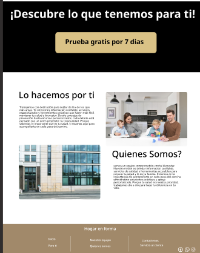

# bit-1

## Autor
[Fabian Beltran](https://github.com/fabian1031/bit-1)

## Descripción
Este es un proyecto que utiliza tecnologías web como HTML, CSS3 y JavaScript para crear una aplicación interactiva. El objetivo es mostrar cómo integrar estas herramientas de manera efectiva en un proyecto práctico.

Puedes ver el diseño del proyecto en Figma: [Ver diseño en Figma](https://www.figma.com/proto/8ldV1W4rcTjHZq2jMKZ9Wa/Untitled?node-id=29-257&p=f&t=L9m3mJWgPFSWR5Ni-0&scaling=min-zoom&content-scaling=fixed&page-id=0%3A1&starting-point-node-id=29%3A257)

### Tecnologías
- HTML
- CSS3
- JavaScript